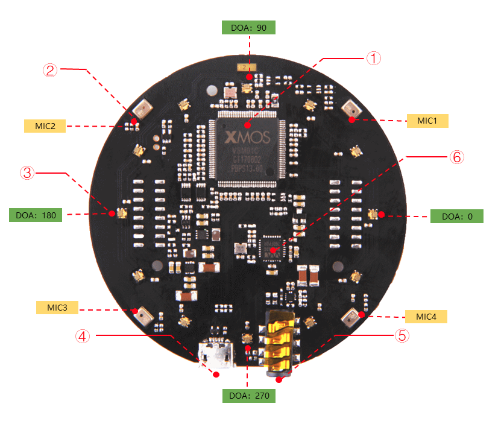

# mic2

* XMOS’s XVF-3000
* voice recvognition algorithms to assist in performance

* Power Supply: 5V DC from Micro USB or expansion header 



Speech algorithms and features

    Voice Activity Detection
    Direction of Arrival
    Beamforming
    Noise Suppression
    De-reverberation
    Acoustic Echo Cancellation


## fws
* two firmware versions available, one including speech algorithms and a second for raw voice data.

```
1_channel_firmware.bin	:  Processed audio for ASR

6_channels_firmware.bin	:
    Channel 0: processed audio for ASR
    Channel 1: mic1 raw data
    Channel 2: mic2 raw data
    Channel 3: mic3 raw data
    Channel 4: mic4 raw data
    Channel 5: merged playback

```


```

sudo python3 dfu.py --download 6_channels_firmware.bin
entering dfu mode
found dfu device
downloading
149056 bytes
done


```


## tuning


```
list:       python tuning.py -p
off:        python tuning.py AGCONOFF 0

the DOA angle:  sudo python tuning.py DOAANGLE

```